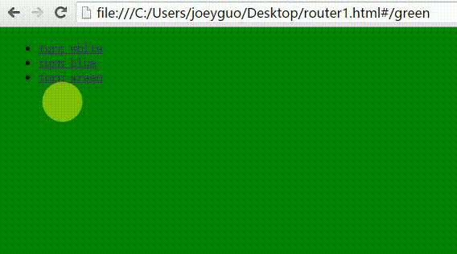

# 一个极简前端路由实现

## 实现原理
### 原理 ： 是通过监听window.url 的 hash 路径变化， 来回调切换界面 
### 具体Router要实现的功能
1. 需初始化时知道对应路径所做的对应事情
2. 需在界面首次加载和url改变时的更新界面的监听
3. 所做改变的refresh方法
### 最终设计Router的属性以及方法
1. 需初始化的routes 路径／事件 的属性， 须具有当前路径的属性
```
 function Router(routes){
     this.routes = routes;
     this.currentUrl = '';
 }
```
 
2. 需要有更新的事件，此处路径改变更新界面颜色 
 
```
 Router.prototype.change = function(color){
     document.querySelector('body').style.backgroundColor = color;
 
 }
 Router.prototype.refresh = function(){
     this.currentUrl = window.location.hash.slice(1) || '/';
     this.change(this.routes[this.currentUrl]);
 }
```

3. 初始化时的监听
 
```
Router.prototype.init = function(){
    window.addEventListener('load',this.refresh.bind(this),false);
    window.addEventListener('hashchange',this.refresh.bind(this),false);
};
```

## 效果

